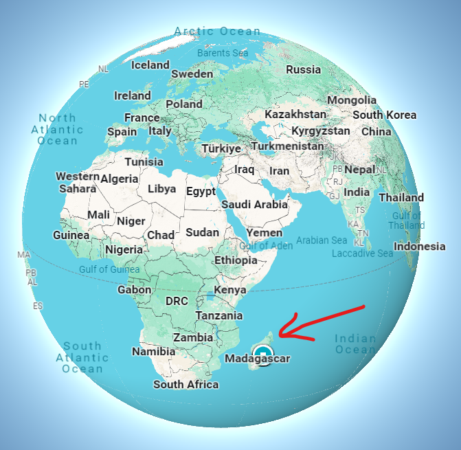

# madagascar_is_not_only_a_movie

## Introduction

You've almost certainly seen the movie **Madagascar**. But have you ever wondered where the name comes from ?  

Before being a movie, Madagascar is above all a country, more specifically an island in the indian ocean. You may be surprised by its size.

    

With a collective of CS students, we decided to start this project about discovering Madagascar through these interactive maps. 

## Contributing

You can contribute by opening a ``pull request``. You can create your map in another ``.js`` and add it as an import in the ``index.html``. Do not forget to add a button for your map in the ``.header``.

In your ``.js``, your map should be wrapped in the ``svg .myDataviz`` and if it needs some options, you could add them in the ``div .mapOptions``.